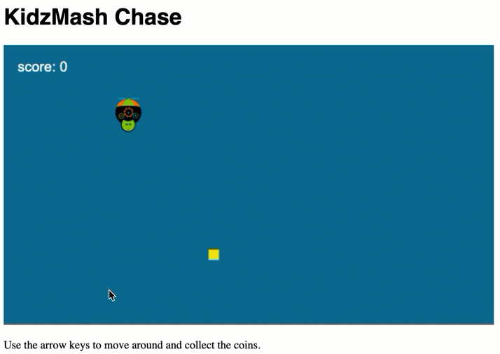
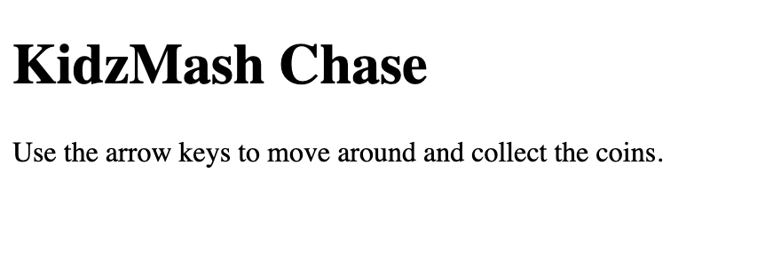
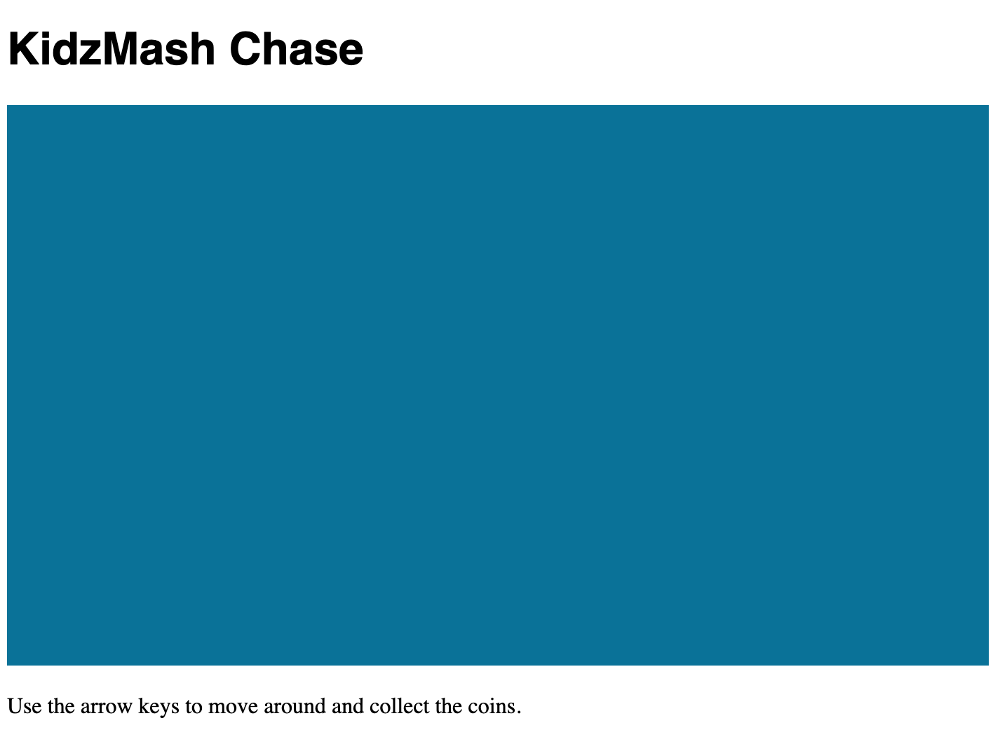

## KidzMash Chase

KidzMash Chase is a simple yet fun game intended to teach people 10 and older the basics of programming and game development using nothing but a browser, the free open source [Phaser.io](http://www.phaser.io/) game framework, JavaScript and HTML.



Ages - 10+  
Cost - $0  

## Prerequisites

Web Browser and Internet connection. That's it. This workshop was intentinally designed to have the minimal amount of tools and setup necessary to make a functional game. 

## Setup

Instead of using a text editor or IDE to write code, we will use the web site [https://jsfiddle.net/]. JSFiddle enables us to edit and run JavaScript, HTML and CSS all inside the browser.

1. Using a web browser to navigate, go to [https://jsfiddle.net/].


JSFiddle is organized in 4 main quadrants. The top left is where you enter HTML, the code that renders a web page. In the top right is where you enter CSS, the style that makes your web pages look attractive. In the bottom left is where you enter JavaScript, a programming language that adds the behavior and functionality to your application/game. Finally, the bottom right is where you see the results after pressing the Run button. This is where you will be able to play the game. 

## Add Web Page

We will start by adding some basic HTML to host the game.

1. In HTML (top left quadrant), add the following html to create a page with a title of KidzMash Chase and a message to the user about how to play the game.

```
<!DOCTYPE html>
<html>
  <head>
    <title>KidzMash Chase</title>
  </head>
  <body>
    <h1>KidzMash Chase</h1>
    <p>Use the arrow keys to move around and collect the coins.</p>
  </body>
</html>
```
2. Press the Run button.

In Result, you should see a basic white web with the title and message.  



## Add Some Style

1. In CSS (top right quadrant), add the following CSS to make the title look prettier with a Helvetica font.
```css
h1 {font-family: "helvetica"}
```
2. Press the Run button.

In Result, you should see the updated title with the Helvetica font.


## Add Phaser.io and Main Seen

Rather than add all the complicated and common code to make a game work such as character movement, physics and collision detection, we will use a popular free and open source framework called Phaser.io that can be found at http://www.phaser.io/ so we can focus on what makes our game fun and unique. In order to do this, in the HTML we will need to add a dependency on the Phaser.io library and a div tag (game) where the game is suppose to be rendered. Next, we will add a JavaScript class representing our main scene. It will set the height, width and background color of our game using a hex value. It will also define the type of physics to use as well as the div to update (game) and the JavaScript class containing the game lifecycle functions (preload, create, update).

The way the Phaser.io framework works and many other game frameworks is the preload function will be called once to load all the game assets like images. Then the create method will be called once to create and initialize any game objects like players. Finally the update function will be called. But it is not called once, it is called over and over again. 60 times a second. This is logic goes to check and change the state of the game, such as were did the user go.

1. In HTML below the `<title>KidzMash Chase</title>` and above `</head>` add the following to load the Phaser.io library.
```html
<script src="//cdn.jsdelivr.net/npm/phaser@3.24.1/dist/phaser.min.js"></script>
```
2. Also in HTML below `<h1>KidzMash Chase</h1>` and above `<p>Use the arrow keys to move around and collect the coins.</p>` add the following game div that Phaser.io will render the game.
```
<div id="game"></div>
```
3. In JavaScript, add the following to set up basic game mechanics.
```javascript
class mainScene {

    preload() {
        // Preload assets like sprites and sounds
    }

    create() {
        // Initialize scene with position of game elements
    }

    update() {
        // update is called 60 times per second and handles game logic
    }
  
}

new Phaser.Game({
    width: 700, // Width of the game in pixels
    height: 400, // Height of the game in pixels
    backgroundColor: '#097297', // The background color (blue)
    scene: mainScene, // The name of the scene we created
    physics: { default: 'arcade' }, // The physics engine to use
    parent: 'game', // Create the game inside the <div id="game"> 
});
```
4. Press the Run button.

You should now see a blue box in your web page.



## Add Player

Now it's time to add a player and make them move around the game scene. We will use an image of a kidzmash as our player.

1. In JavaScript, in the preload function, add the following to load the kidzmash image.
```javascript
this.load.image('player', 'https://cjudd.github.io/kidzmash-chase-game-workshop/images/kidzmash.png');
```
2. In JavaScript, in the create function, add the following to create the player and place them at the coordinates of 100 and 100.
```javascript
this.player = this.physics.add.sprite(100, 100, 'player');
```
3. Press the Run button.

Now you should have the kidzmash/player in the blue game square.


## Add Movement

The game isn't very interesting if the player just sits on the screen. It needs to move.

1. In JavaScript, in the create function, add the following after the player is created.
```javascript
this.arrow = this.input.keyboard.createCursorKeys();
```
2. In JavaScript, in the update function, add the following to change the players location when the arrow keys are pressed.
```javascript
		if (this.arrow.right.isDown) {
		  this.player.x += 3;
		} else if (this.arrow.left.isDown) {
		  this.player.x -= 3;
		} 

		if (this.arrow.down.isDown) {
		  this.player.y += 3;
		} else if (this.arrow.up.isDown) {
		  this.player.y -= 3;
		} 
```
3. Press the Run button.
4. Make sure the Results has focus by clicking in it and then use your arrow keys to move the character around.

## Add Purpose

Having a player running around the screen without any goal or purpose wouldn't be fun for long. So we are going to add a coin for the player go and get. Once that player collides/overlaps with the coin a new coin will be randomly generated for the player retrieve.

1. In JavaScript, in the create function, add the following to load the coin image.
```javascript
this.load.image('coin', 'https://cjudd.github.io/basic-js-game-workshop/images/coin.png');
```
2. In the JavaScript, in the update function, add the following to initially create a coin.
```javascript
this.coin = this.physics.add.sprite(300, 300, 'coin');
```
3. In JavaScript, in the update function add the following to detect the collision/overlap and call a hit function.
```javascript
        // collision detection between player and coin
        if (this.physics.overlap(this.player, this.coin)) {
  		    this.hit();
		}
```
4. In JavaScript, above the `}` that is above `new Phaser.Game({` add the following to randomly generate the new coin and make the game more interesting by temporarily growing the player to 120% it's original size. 
```javascript
    hit() {
  	    // Randomly generate location of new coin
  	    this.coin.x = Phaser.Math.Between(100, 600);
  	    this.coin.y = Phaser.Math.Between(100, 300);

	    this.tweens.add({
		    targets: this.player, // on the player 
		    duration: 200, // for 200ms 
		    scaleX: 1.2, // increase scale vertically by 20% 
		    scaleY: 1.2, // increase scale horizontally by 20% 
		    yoyo: true, // at the end, go back to original scale 
	    });
    }
```
5. Press the Run button.
6. Make sure the Results has focus by clicking in it and then use your arrow keys to move the character to retrieve the coin. Notice how the player grows and the coin spawns in a new location.


## Add Scoring

Of course while playing the game, you will want to know how many coins you have retrieved, so we will add scoring.

1. In JavaScript, in the create function, add the following to create an initial score of 0 and draw a place to display the score.
```javascript
        // set, style and display score
		this.score = 0;
		let style = { font: '20px Arial', fill: '#fff' };
		this.scoreText = this.add.text(20, 20, 'score: ' + this.score, style);
```
2. In JavaScript, in the hit function, add the following after `this.coin.y = Phaser.Math.Between(100, 300);` to set and render the current score.
```javascript
  	    // Increment the score
  	    this.score += 10;
  	    this.scoreText.setText('score: ' + this.score);
```
3. Make sure the Results has focus by clicking in it and then use your arrow keys to move the character around to grab coins and watch your score.


## Experiment

Many software developers got their start copy and pasting code and making modifications to see what it would do. So experiment. Try causing the player to grow by 200%. Try making player spawn in the center of the screen. It is your game so make it yours.

## Final Solution

If you run into problems or just want to get to the solution quickly, you can copy and paste the solution into the 3 corresponding quadrants and run it. 

In HTML:

```html
<!DOCTYPE html>
<html>
  <head>
    <meta charset="UTF-8">
    <title>KidzMash Chase</title>
    <script src="//cdn.jsdelivr.net/npm/phaser@3.24.1/dist/phaser.min.js"></script>
  </head>
  <body>
    <h1>KidzMash Chase</h1>
    <div id="game"></div>
    <p>Use the arrow keys to move around and collect the coins.</p>
  </body>
</html>
```

In CSS

```css
h1 {font-family: "helvetica"}
```

In JavaScript + No-Library (pure JS)

```javascript
class mainScene {
    preload() {
        // Preload assets like sprites and sounds
        this.load.image('player', 'https://cjudd.github.io/kidzmash-chase-game-workshop/images/kidzmash.png');
        this.load.image('coin', 'https://cjudd.github.io/kidzmash-chase-game-workshop/images/coin.png');
    }

    create() {
        // Initialize scene with position of game elements
        this.player = this.physics.add.sprite(100, 100, 'player');
        this.coin = this.physics.add.sprite(300, 300, 'coin');
    
        // set, style and display score
		this.score = 0;
		let style = { font: '20px Arial', fill: '#fff' };
		this.scoreText = this.add.text(20, 20, 'score: ' + this.score, style);

        // enable arrow keys
        this.arrow = this.input.keyboard.createCursorKeys();
    }

    update() {
        // update is called 60 times per second and handles game logic

		if (this.arrow.right.isDown) {
		  this.player.x += 3;
		} else if (this.arrow.left.isDown) {
		  this.player.x -= 3;
		} 

		if (this.arrow.down.isDown) {
		  this.player.y += 3;
		} else if (this.arrow.up.isDown) {
		  this.player.y -= 3;
		} 
    
        // collision detection between player and coin
        if (this.physics.overlap(this.player, this.coin)) {
  		    this.hit();
		}
  }
  
    hit() {
  	    // Randomly generate location of new coin
  	    this.coin.x = Phaser.Math.Between(100, 600);
  	    this.coin.y = Phaser.Math.Between(100, 300);

  	    // Increment the score
  	    this.score += 10;
  	    this.scoreText.setText('score: ' + this.score);

	    this.tweens.add({
		    targets: this.player, // on the player 
		    duration: 200, // for 200ms 
		    scaleX: 1.2, // increase scale vertically by 20% 
		    scaleY: 1.2, // increase scale horizontally by 20% 
		    yoyo: true, // at the end, go back to original scale 
	    });
    }
}

new Phaser.Game({
    width: 700, // Width of the game in pixels
    height: 400, // Height of the game in pixels
    backgroundColor: '#097297', // The background color (blue)
    scene: mainScene, // The name of the scene we created
    physics: { default: 'arcade' }, // The physics engine to use
    parent: 'game', // Create the game inside the <div id="game"> 
});
```

Inspired by the LessCake [Learn to make HTML5 games with Phaser 3](https://www.lesscake.com/phaser-game-tutorial){:target="_blank"} tutorial.